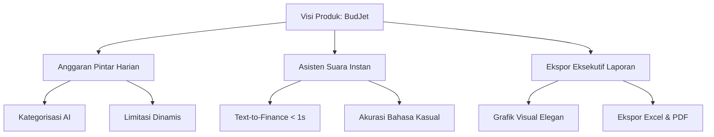

# 📑 BudJet Technical Architecture & UI/UX Audit (v3 SSOT)
**Author:** Senior Creative Tech Lead & UI/UX Auditor  
**Target:** BudJet Landing Page (v3) — Core Design & Engineering Reference for Version 4  
**Date:** May 7, 2026

---

## 🧭 1. Konsep & Arsitektur Proyek

### 🚀 Visi Produk: BudJet
**BudJet** diposisikan sebagai *Awwwards-level Personal Finance App* yang dikonseptualisasikan secara khusus untuk ekosistem mahasiswa dan anak kos. Mengusung tagline *"BudJet smarter, live better"*, visi produk ini berfokus pada pemecahan masalah krusial keuangan mahasiswa (seperti ketidakpastian pengeluaran bulanan, rumitnya pembagian alokasi dana, dan hambatan psikologis dalam mencatat uang secara manual) dengan menyajikan antarmuka super-modern, cerdas, instan, dan menyenangkan (*gamified & elegant*). 

Identitas visual dan teknisnya dirancang untuk memadukan kedisiplinan keuangan (*sleek dark slate*) dengan gairah kreativitas anak muda (*vibrant lime green & tech blue*), menjadikannya aplikasi finansial yang tidak membosankan dan sangat intuitif untuk dipantau setiap hari.



### 📐 Arsitektur 3D: Global Canvas vs. Container-Locked Canvas Architecture
Dalam pengembangan kreatif modern, menampilkan elemen 3D responsif sering kali berbenturan dengan masalah stabilitas layout dan performa render. Landing Page BudJet v3 menyelesaikan tantangan ini melalui transisi arsitektural yang matang:

```
┌────────────────────────────────────────────────────────┐
│ GLOBAL CANVAS ARCHITECTURE (Old/Conventional)          │
│ ┌────────────────────────────────────────────────────┐ │
│ │  Single Big WebGL Canvas (Background Layer)         │ │
│ │  - Floats independently behind entire DOM          │ │
│ │  - Hard to align with text across screen sizes     │ │
│ │  - High risk of text overlapping models            │ │
│ └────────────────────────────────────────────────────┘ │
└────────────────────────────────────────────────────────┘

┌────────────────────────────────────────────────────────┐
│ CONTAINER-LOCKED CANVAS ARCHITECTURE (BudJet v3)       │
│ ┌──────────────────┐                  ┌──────────────┐ │
│ │  DOM Text Block  │  <-- Fluid -->   │ Visual Block │ │
│ │                  │                  │  ┌────────┐  │ │
│ │  - Standard HTML │   Grid Layout    │  │ Canvas │  │ │
│ │  - Flow Layout   │                  │  └────────┘  │ │
│ └──────────────────┘                  └──────────────┘ │
└────────────────────────────────────────────────────────┘
```

#### Mengapa Menggunakan *Container-Locked Canvas Architecture*?
1. **Fluid Responsive Alignment:** Dibandingkan membiarkan satu kanvas besar mengambang bebas di belakang seluruh DOM (*Global Canvas*), kami mengunci (*lock*) instansi kanvas atau objek 3D di dalam modul kontainer HTML visual tertentu (`.visual-block` di dalam grid flexbox responsif). Kanvas Three.js/CSS-3D ini mematuhi aturan tata letak CSS standar (`grid grid-cols-1 md:grid-cols-2`).
2. **Pencegahan Overlap Teks:** Dengan memisahkan visual 3D ke kolom mandiri, teks judul dan deskripsi di kolom sebelah kiri dijamin tidak akan pernah tertabrak oleh ponsel 3D, terlepas dari seberapa ekstrem rasio aspek layar browser pengguna diperkecil atau diperbesar.
3. **Optimasi Thread & CPU:** Kanvas WebGL yang diisolasi di kontainer tertentu mempermudah integrasi Intersection Observer. Kami hanya perlu mengaktifkan rendering loop ketika kontainer tersebut berada di dalam viewport (*lazy rendering*), menghemat siklus CPU secara drastis pada perangkat mobile berspesifikasi rendah.

---

## 🛠️ 2. Teknologi (Tech Stack)

Arsitektur aplikasi dibangun di atas tumpukan teknologi modern berkecepatan tinggi yang dirancang untuk performa *high-fidelity* tanpa mengorbankan fluiditas interaksi.

| Teknologi | Fungsi Utama | Peran Teknis & Integrasi |
| :--- | :--- | :--- |
| **React + Vite** | Fondasi Aplikasi & Bundler | Menyediakan ekosistem modular berbasis komponen, *Fast Refresh* (HMR) instan selama masa pengembangan, dan kompilasi bundle produksi yang sangat optimal melalui pengoptimalan *tree-shaking*. |
| **Tailwind CSS v4** | Sistem Desain & Antarmuka | Menggunakan dekorator `@theme` modern berbasis CSS custom properties. Menghasilkan gaya yang ringan, konsisten, dan sangat cepat tanpa perlu menulis CSS utility manual yang berulang. |
| **Three.js** | Core Grafis 3D | Mesin utama untuk kalkulasi geometri 3D, material, pencahayaan studio, pencahayaan ambient, dan rendering matematika ruang 3D. |
| **React Three Fiber (R3F)** | Integrasi Deklaratif 3D | Menjembatani Three.js ke dalam siklus hidup (*lifecycle*) komponen React. Memudahkan manajemen state 3D, event handling mouse, dan penghancuran (*garbage collection*) objek 3D. |
| **@react-three/drei** | Helper & Utilitas R3F | Menyediakan komponen siap pakai berkualitas tinggi seperti `<RoundedBox />` untuk geometri smartphone, `<Sparkles />` untuk efek partikel futuristik, dan hook `useTexture` untuk pre-loading gambar aset layar tanpa *lagging*. |
| **GSAP (GreenSock) + ScrollTrigger** | Core Animasi & Viewport Sync | Mengatur garis waktu (*timeline*) animasi transisi, rotasi parallax berdasarkan koordinat mouse, efek melayang (*idle floating*), dan trigger animasi kemunculan elemen DOM & 3D saat di-scroll. |
| **Lenis Smooth Scroll** | Penghilang Scroll Jank | Menyediakan mekanisme *smooth scrolling* berbasis fisika yang menyamakan tingkat penyegaran layar (FPS) dengan kalkulasi ScrollTrigger. Memastikan efek parallax dan transisi footer reveal berjalan mulus tanpa patahan. |
| **UI Library / Style** | Sentuhan Estetika Premium | Menginspirasi pembuatan efek-efek kartu futuristik interaktif seperti *3D Tilt Card*, *Glossy Glare Overlay*, dan kontainer perbatasan dinamis (*moving borders*). |

---

## 🔍 3. Bedah Komponen & UX (Deep Dive)

### 📱 3.1 Hero Section: Dual-Phone Stacked Combo
Visual utama di bagian Hero menggunakan konsep tata letak ponsel ganda yang ditumpuk secara spasial (*Dual-Phone Stacked Combo*):

```
                       ▲ +Y Axis
                       │
             ┌───────────────────┐ (Foreground: Home Mockup)
             │   ┌───────────┐   │ - Scale: 1.0 (Larger)
             │   │  Rp 150K  │   │ - Position: Shifted Left (-45px)
             │   └───────────┐   │ - Rotation: Rotated Counter-Clockwise (-12deg Y)
             │               │   │ - Parallax Multiplier: 28x (More Intense)
   ◄─────────┼───────────────┼─────────► +X Axis
   -X Axis   │               │   │     +Y Axis
             │ ┌───────────┐ │   │
             │ │  Login    │ │   │ (Background: Login Mockup)
             │ └───────────┘ │   │ - Scale: 0.88 (Smaller for depth)
             └───────────────┘   │ - Position: Shifted Right (+45px) & Z-Depth (-150px)
             │                   │ - Rotation: Rotated Clockwise (+15deg Y)
             └───────────────────┘ - Parallax Multiplier: 16x (Subtle)
                       │
                       ▼ -Y Axis
```

*   **Logika Rotasi & Mouse Tracking (Interactive Parallax Tilt):**
    Di dalam [InteractivePhoneShowcase.jsx](file:///c:/DevProjects/Flutter/PROYEK-PDBL/web_platform/landing-pagev3/src/components/InteractivePhoneShowcase.jsx), kami melacak pergerakan mouse relatif terhadap kontainer utama:
    ```javascript
    const rect = container.getBoundingClientRect()
    const x = e.clientX - rect.left 
    const y = e.clientY - rect.top
    const px = (x / rect.width) - 0.5   // Range: [-0.5, 0.5]
    const py = (y / rect.height) - 0.5  // Range: [-0.5, 0.5]
    ```
    Nilai ter-normalisasi `px` (X) dan `py` (Y) ini kemudian diumpankan ke mesin animasi GSAP untuk merotasi telepon secara dinamis secara real-time:
    *   **Foreground Phone (Home):** Merespons lebih kuat terhadap gerakan mouse:
        $$\text{rotateY} = -12^{\circ} + px \times 28$$
        $$\text{rotateX} = 10^{\circ} - py \times 28$$
    *   **Background Phone (Login):** Merespons lebih lambat untuk menciptakan kedalaman spasial semu (*3D parallax depth*):
        $$\text{rotateY} = 15^{\circ} + px \times 16$$
        $$\text{rotateX} = -8^{\circ} - py \times 16$$
    *   **Reset Koordinat:** Saat kursor meninggalkan kontainer (`mouseleave`), koordinat telepon di-kembalikan secara perlahan (*easing power2.out* selama 0.8 s) ke posisi idle semula untuk mempertahankan kestabilan visual.

*   **Idle Breathing Animation:**
    Saat kursor diam, telepon tetap terasa "hidup" melalui animasi melayang (*floating*) konstan berbasis gelombang sinus sinusoidal:
    *   Telepon depan bobbing secara vertikal (`y: -12px`, durasi 3.0 detik, yoyo, repeat tak terbatas).
    *   Telepon belakang bobbing secara vertikal (`y: 10px`, durasi 2.6 s, yoyo, repeat tak terbatas) dengan delay phase sebesar `0.3` s untuk menghasilkan ritme pernapasan alami yang asinkron.

---

### 🎨 3.2 Features (Z-Pattern Layout)
Bilah fitur dirancang menggunakan struktur tata letak Z-Pattern ritmis (Teks Kiri $\rightarrow$ Gambar Kanan, diikuti Gambar Kiri $\rightarrow$ Teks Kanan). Struktur ini terbukti memandu arah gerak mata pembaca secara alami tanpa melelahkan kognitif.

```
Row 1: Daily Smart Budgeting  -----> [Text Block Left] ────► [3D Mockup Right (Lime Glow)]
Row 2: Voice Assistant        -----> [3D Mockup Left (Blue Glow)] ◄─── [Text Block Right]
Row 3: Monthly Reports        -----> [Text Block Left] ────► [3D Mockup Right (Lime Glow)]
```

*   **3D Card Tilt Effect:**
    Komponen [FeaturesSection.jsx](file:///c:/DevProjects/Flutter/PROYEK-PDBL/web_platform/landing-pagev3/src/components/FeaturesSection.jsx) menyediakan helper `TiltCard` dengan efek glare glossy bergerak. Menggunakan translasi matriks CSS 3D (`transformStyle: 'preserve-3d'`, `transform: 'translateZ(20px)'`) yang membuat isi konten di dalam kartu terasa menonjol keluar dari bingkai saat permukaan kartu berputar miring mengikuti koordinat mouse.
*   **Efek Cahaya Neon Ambient:**
    Setiap baris visual dibekali gradasi lingkaran berpendar (*glow backdrop filter*) di belakang ponsel yang memiliki skema warna neon yang disesuaikan secara dinamis:
    *   Fitur Anggaran Harian & Ekspor Laporan menggunakan **Lime Green Glow** (`bg-brand-lime/15 shadow-brand-lime/10`) untuk merepresentasikan stabilitas, pertumbuhan, dan kesegaran keuangan mahasiswa.
    *   Fitur Asisten Suara menggunakan **Blue Glow** (`bg-brand-blue/15 shadow-brand-blue/10`) untuk memunculkan asosiasi psikologis terhadap kecerdasan buatan (AI), kenyamanan audio, dan teknologi tinggi.

---

### 💬 3.3 Motivational Quote Word-Reveal
Bagian kutipan motivasional dari John C. Maxwell di [QuoteSection.jsx](file:///c:/DevProjects/Flutter/PROYEK-PDBL/web_platform/landing-pagev3/src/components/QuoteSection.jsx) menyajikan interaksi pembacaan teks yang sangat premium dan sinematik:

```
[Scroll Down] ────► Viewport 80% ────► Quote Marks Fade In & Scale Up (0.3 -> 1.0)
                                            │
                                            ▼
                                  Words Reveal Staggered (Stagger: 0.04s)
                                  - Opacity: 0 -> 1
                                  - Translation Y: 24px -> 0
                                  - Blur Filter: blur(6px) -> blur(0px)
```

*   **Mekanisme Word-Reveal:**
    Teks dipisahkan secara terprogram berdasarkan spasi karakter menggunakan fungsi JavaScript `.split(" ")` dan dipetakan ke dalam deretan elemen `span` dengan kelas `.quote-word`:
    ```javascript
    {words.map((word, idx) => (
      <span key={idx} className="quote-word inline-block mr-[0.25em] origin-bottom">
        {word}
      </span>
    ))}
    ```
*   **Kalkulasi ScrollTrigger & GSAP:**
    Ketika bagian atas Quote Section menyentuh batas `80%` tinggi viewport pengguna, sebuah GSAP timeline dijalankan:
    1. Dua tanda kutip raksasa (`“` dan `”`) dimunculkan secara dramatis (`opacity: 0.15`, `scale: 1`, `ease: 'back.out(1.7)'`).
    2. Kata-kata di-reveal satu per satu dengan penundaan staggered (`stagger: 0.04s`). Properti transisi melibatkan transformasi sumbu vertikal (`y` dari `24px` ke `0px`), kemunculan opacity, dan peleburan blur optik (`filter: 'blur(6px)'` menuju `blur(0px)`) secara simultan bersamaan dengan munculnya tanda petik raksasa di latar belakang.

---

### 🎢 3.4 Testimonial Marquee: Infinite Opposing Scroll

Untuk menyajikan ulasan yang masif tanpa memakan area tinggi halaman secara berlebihan, kontainer ulasan dibagi menjadi dua kolom (Desktop) atau dua baris (Mobile) yang beroperasi berlawanan arah secara terus-menerus.

```
DESKTOP SYSTEM (Vertical Loop)
┌─────────────────────────┐ ┌─────────────────────────┐
│  Column 1 (Scroll Down)  │ │   Column 2 (Scroll Up)  │
│  - Movement: yPercent   │ │  - Movement: yPercent   │
│    0% -> -50%           │ │    -50% -> 0%           │
│  - Speed: 22s Duration  │ │  - Speed: 22s Duration  │
└─────────────────────────┘ └─────────────────────────┘

MOBILE SYSTEM (Horizontal Loop)
┌─────────────────────────────────────────────────────┐
│  Row 1 (Scroll Left) : xPercent 0% -> -50% (16s)    │
├─────────────────────────────────────────────────────┤
│  Row 2 (Scroll Right): xPercent -50% -> 0% (16s)    │
└─────────────────────────────────────────────────────┘
```

*   **Logika Looping & Duplikasi Aset:**
    Data ulasan diduplikasi secara lokal (`[...TESTIMONIALS_COL_1, ...TESTIMONIALS_COL_1]`) sehingga tinggi fisik total kontainer menjadi tepat dua kali lipat tinggi aslinya. GSAP kemudian menggeser posisi kontainer dari `0%` ke `-50%` (atau sebaliknya) menggunakan tipe perulangan tanpa henti (`repeat: -1`, `ease: 'none'`). Begitu posisi menyentuh perbatasan `-50%`, kontainer direset instan ke posisi `0%` tanpa patahan visual sekecil apa pun (*seamless loop*).
*   **Hover-to-Pause Deceleration:**
    Jika pengguna merasa tertarik membaca ulasan tertentu dan mengarahkan kursornya di atas area kartu, interaksi tidak langsung berhenti mendadak (yang mana terasa sangat kaku dan kasar). Kami menerapkan pelambatan kecepatan linier secara halus (*gentle deceleration/acceleration*):
    ```javascript
    const setupHoverPause = (el, tween) => {
      const handleMouseEnter = () => {
        gsap.to(tween, { timeScale: 0.05, duration: 0.5, ease: 'power2.out' })
      }
      const handleMouseLeave = () => {
        gsap.to(tween, { timeScale: 1.0, duration: 0.5, ease: 'power2.out' })
      }
      // ... Event listener binding ...
    }
    ```
    Kecepatan waktu animasi (`timeScale`) direduksi secara lembut dari kecepatan penuh (`1.0`) menjadi hanya `5%` (`0.05`) dalam rentang waktu `0.5` s. Saat kursor keluar, kecepatan dipercepat kembali ke `1.0` secara mulus. Ini mencegah tabrakan FPS render pada GPU seluler dan meningkatkan kenyamanan membaca pengguna secara signifikan.

---

### 📂 3.5 FAQ & Footer: Accordion & Parallax Reveal
*   **FAQ Accordion Height Animation:**
    Patahan kasar sering terjadi pada komponen akordeon standar karena keterbatasan CSS dalam mentransisikan tinggi elemen dari `height: 0` ke `height: auto` tanpa besaran piksel yang pasti. Di dalam [FaqSection.jsx](file:///c:/DevProjects/Flutter/PROYEK-PDBL/web_platform/landing-pagev3/src/components/FaqSection.jsx), hal ini diselesaikan melalui manipulasi properti dinamis GSAP:
    ```javascript
    gsap.fromTo(contentRefs.current[index], 
      { height: 0, opacity: 0 }, 
      { height: 'auto', opacity: 1, duration: 0.45, ease: 'power2.out', overwrite: 'auto' }
    )
    ```
    Dengan menyetel `overwrite: 'auto'`, sistem otomatis memotong dan menghentikan transisi penutupan akordeon sebelumnya jika pengguna mengeklik tombol pertanyaan lain secara membabi buta, menjamin kelancaran navigasi.
*   **Footer Parallax Reveal:**
    Efek ini memanfaatkan penataan urutan tumpukan elemen (*z-index stacking layers*) yang cerdas dan hemat performa:
    ```css
    .uncover-wrapper {
      position: relative;
      z-index: 20; /* Lebih tinggi */
      background-color: var(--color-brand-bg);
      box-shadow: 0 25px 50px -12px rgba(0,0,0,0.05);
    }
    .reveal-footer {
      position: relative;
      z-index: 5; /* Lebih rendah */
    }
    ```
    Dan di dalam komponen [Footer.jsx](file:///c:/DevProjects/Flutter/PROYEK-PDBL/web_platform/landing-pagev3/src/components/Footer.jsx), ditambahkan gaya posisi `sticky bottom-0`. Di layar monitor besar, saat pengguna men-scroll ke bagian bawah halaman, blok wrapper DOM `.uncover-wrapper` seolah terangkat naik ke atas dan "mengungkap" (*uncover*) komponen footer di bawahnya secara elegan, menciptakan kesan visual kedalaman paralaks tiga dimensi yang sangat mengesankan tanpa menulis sebaris pun kode JavaScript yang berat.

---

## 🎨 4. Sistem Visual (Design System v3)

### 🎨 4.1 Palet Warna Resmi
Sistem desain visual dikonfigurasi melalui properti CSS kustom Tailwind v4 di dalam berkas [index.css](file:///c:/DevProjects/Flutter/PROYEK-PDBL/web_platform/landing-pagev3/src/index.css) untuk menjamin konsistensi rendering:

```
┌────────────────────────────────────────────────────────┐
│ BRAND COLOR PALETTE                                    │
│ ┌──────────────┐  Slate Dark: #0F172A (Text/Elements)  │
│ │              │  - Perfect contrast for readability   │
│ └──────────────┘                                       │
│ ┌──────────────┐  Lime Green: #D4E866 (Brand Highlight)│
│ │              │  - Modern accent, youthful energy     │
│ └──────────────┘                                       │
│ ┌──────────────┐  Aksen Blue: #60A5FA (Tech AI Status) │
│ │              │  - Friendly contrast to Lime Green    │
│ └──────────────┘                                       │
│ ┌──────────────┐  Neutral Light: #F8F9FA (Background)  │
│ │              │  - Extremely soft & elegant canvas    │
│ └──────────────┘                                       │
└────────────────────────────────────────────────────────┘
```

*   **--color-brand-slate (`#0F172A`):** Warna gelap utama untuk teks, ikon kontras tinggi, dan tombol aksi premier. Memberikan getaran profesional dan kokoh.
*   **--color-brand-dark (`#1E293B`):** Warna abu-abu gelap sekunder yang digunakan sebagai material dasar ponsel 3D dan bingkai kontainer solid.
*   **--color-brand-lime (`#D4E866`):** Warna hijau jeruk nipis dinamis yang bertindak sebagai aksen visual utama (*brand highlight*). Warna ini memicu perhatian pengguna secara instan tanpa mengganggu kenyamanan pandangan.
*   **--color-brand-lime-dark (`#BEF264`):** Varian hijau yang lebih matang, digunakan khusus pada efek hover tombol aksi utama dan indikator aktif navigasi.
*   **--color-brand-blue (`#60A5FA`):** Warna biru muda modern sebagai penyeimbang harmonis (*complementary color*) dari warna Lime Green, memberikan asosiasi visual terhadap teknologi cerdas AI, asisten audio, dan data yang aman.
*   **--color-brand-bg (`#F8F9FA`):** Warna abu-abu putih super lembut sebagai latar belakang kanvas website, menciptakan nuansa bersih, lapang (*spacious*), dan elegan.
*   **--color-brand-card (`#FFFFFF`):** Putih bersih murni untuk elemen kartu kontainer di atas latar belakang abu-abu lembut.
*   **--color-brand-border (`#F3F4F6`):** Abu-abu yang sangat samar untuk pemisah garis border tipis yang halus.
*   **--color-brand-text-muted (`#64748B`):** Abu-abu gelap pudar untuk tulisan deskripsi paragraf panjang agar tidak menimbulkan kelelahan mata saat dibaca.

---

### 🔠 4.2 Tipografi & Hierarki Teks
Karakteristik landing page memadukan dua keluarga font premium dari Google Fonts:
1.  **'Inter' (sans-serif):** Digunakan untuk seluruh blok paragraf teks biasa, deskripsi fitur, ulasan, dan navigasi. Inter memiliki keterbacaan (*legibility*) yang luar biasa tajam pada layar beresolusi rendah sekalipun.
2.  **'Plus Jakarta Sans' (sans-serif):** Digunakan untuk seluruh judul utama (*heading*), tajuk seksi, nama tombol, dan komponen akordeon. Plus Jakarta Sans memiliki karakter huruf geometris yang tegas, modern, dinamis, dan sangat tebal, memberikan kesan visual eksklusif kelas atas.

#### Skala Hierarki Ukuran Teks Resmi:
*   **Hero Main Title:** `text-5xl sm:text-6xl lg:text-7xl xl:text-8xl` (Masif, tebal, langsung menangkap pandangan utama pengguna).
*   **Section Title:** `text-3xl sm:text-4xl lg:text-5xl font-extrabold` (Digunakan di judul Fitur, Ulasan, dan FAQ).
*   **Component Title / Feature Row Name:** `text-2xl sm:text-3xl lg:text-4xl font-extrabold` (Judul di baris-baris detail fitur).
*   **Body Description Paragraph:** `text-base sm:text-lg lg:text-xl font-light` (Deskripsi panjang dengan teks tipis berjarak baris lebar untuk kenyamanan maksimal).
*   **Badge Text & Navigation Menu:** `text-xs sm:text-sm font-bold uppercase tracking-wider` (Memberikan ketegasan pada teks pendukung).

---

## ⚡ 5. Analisis Performa & Responsivitas (UI/UX Audit)

Sebagai UI/UX Auditor, kami memeriksa stabilitas rendering halaman landing page di bawah berbagai kondisi beban grafis:

### ⚙️ 5.1 Penanganan WebGL Context & Kebocoran Memori (Memory Leak Protection)
Halaman web yang memuat rendering 3D interaktif berisiko tinggi mengalami kebocoran memori RAM (*memory leaks*) dan tabrakan render (*WebGL context lost crashes*) jika pengguna meninggalkan tab browser terbuka terlalu lama atau melakukan scroll atas bawah berulang kali. 

Di dalam komponen 3D [ThreeSmartphone.jsx](file:///c:/DevProjects/Flutter/PROYEK-PDBL/web_platform/landing-pagev3/src/components/ThreeSmartphone.jsx), kami menerapkan sistem keamanan memori berstandar industri:
1.  **Complete Resource Disposal pada Unmount:**
    Ketika komponen di-unmount dari DOM, hook pembersih React dipicu secara penuh untuk membuang event listener global dan membunuh tween GSAP yang sedang mengambang bebas:
    ```javascript
    return () => {
      // Menghentikan dan menghapus event listener global
      window.removeEventListener('mousemove', handleMouseMove)
      window.removeEventListener('resize', handleResize)
      
      // Mematikan paksa seluruh timeline ScrollTrigger lokal
      ScrollTrigger.getAll().forEach((trigger) => {
        if (trigger.trigger === parentContainer) {
          trigger.kill()
        }
      })
    }
    ```
2.  **DPR Limit & GPU Optimization:**
    Penyetelan rasio piksel perangkat (*Device Pixel Ratio* - DPR) dikunci secara ketat pada rentang `[1, 1.5]`. Secara bawaan, Three.js sering menyetel DPR sesuai nilai layar bawaan (misal `3x` pada layar retina Macbook atau iPhone modern). DPR yang terlalu tinggi tidak memberikan perbedaan visual yang kasat mata pada layar sekecil itu, namun melipatgandakan jumlah kalkulasi piksel shader GPU sebanyak sembilan kali lipat. Membatasi DPR pada `1.5` menjamin suhu perangkat mobile tetap dingin dan menghemat daya baterai.
3.  **Texture Optimization:**
    Setiap tekstur yang dimuat melalui hook `useTexture` secara otomatis dinonaktifkan pembuatan mipmap-nya (`generateMipmaps = false`) dan difilter menggunakan `LinearFilter` untuk mengurangi beban alokasi memori VRAM GPU secara signifikan.

---

### 📱 5.2 Strategi Stacking Vertikal pada Tampilan Mobile (Mobile UX Stacking)
Pada layar ponsel pintar (lebar layar < 768px), memaksakan elemen 3D interaktif bersanding di sebelah teks akan membuat tata letak hancur, teks terpotong, dan kanvas 3D tidak responsif. 

Landing Page BudJet v3 memecahkan kendala ini melalui strategi pengurutan baris seluler (*Mobile UX Stacking Strategy*):

```
┌────────────────────────────────────────┐
│ MOBILE VIEWPORT STACKING (e.g. iPhone) │
│ ┌────────────────────────────────────┐ │
│ │             Badge Banner           │ │
│ ├────────────────────────────────────┤ │
│ │             Main Title             │ │
│ ├────────────────────────────────────┤ │
│ │         Short Description          │ │
│ ├────────────────────────────────────┤ │
│ │       3D Interactive Canvas        │ │  <-- Scaled down to 0.72
│ │       - Centered alignment         │ │  - Prevents blocking gestures
│ │       - High contrast backgrounds │ │  - Height-constrained
│ ├────────────────────────────────────┤ │
│ │            Action Buttons          │ │
│ └────────────────────────────────────┘ │
└────────────────────────────────────────┘
```

1.  **Runtuh Grid Kolom:** Mengubah seluruh grid berdampingan menjadi baris vertikal tunggal (`grid-cols-1`).
2.  **Optimalisasi Urutan Taktis (Order Re-arrangement):**
    Menggunakan utilitas pemosisian urutan CSS flexbox (`order-1 md:order-2` dan `order-2 md:order-1`). Pada desktop, teks berada di sisi kiri dan ponsel 3D di sisi kanan. Pada tampilan ponsel pintar, judul teks diletaktan di paling atas untuk memastikan pengguna memahami informasi penting terlebih dahulu, diikuti dengan kanvas ponsel 3D yang megah di bawahnya, dan diakhiri dengan tombol aksi unduh (CTA) di bagian dasar yang mudah dijangkau oleh ibu jari pengguna.
3.  **Penskalaan Dinamis Berbasis Deteksi Lebar Layar:**
    Skala model 3D di-hitung ulang secara real-time pada saat inisialisasi awal. Pada layar komputer lebar, skala model diatur pada tingkat `0.95`, sementara pada layar ponsel pintar skala diperkecil menjadi `0.72`. Pembatasan ini mencegah model 3D memakan terlalu banyak ruang vertikal layar, menjamin elemen teks penting tidak tertutup, dan mencegah pengguna salah menyentuh kanvas 3D secara tidak sengaja ketika hendak melakukan scrolling halaman.

---

## 🔮 6. Rekomendasi Pengembangan Masa Depan (BudJet v4 Roadmaps)

Untuk meningkatkan kesuksesan platform BudJet ke level berikutnya pada versi mendatang (BudJet v4), kami merekomendasikan tiga langkah perluasan teknis berikut:
1.  **WebGL Physics Integration:** Mengintegrasikan pustaka fisika 3D ringan seperti `cannon-es` ke dalam kontainer kanvas. Saat pengguna menggerakkan mouse atau melakukan scroll cepat, koin-koin 3D "Rp" dan "$" dapat saling bertabrakan dan terpantul secara realistis dari tubuh smartphone, menghadirkan level gamifikasi finansial yang luar biasa tinggi.
2.  **Interactive Budget Simulator:** Menyediakan formulir mini interaktif di dalam kolom teks samping fitur anggaran harian. Ketika calon pengguna memasukkan angka uang saku bulanan mereka (misal: "Rp 1.500.000"), ponsel 3D di kolom kanan akan langsung memperbarui grafik statistiknya secara real-time di dalam material kanvas Three.js, memberikan demonstrasi produk (*live simulation demo*) yang sangat meyakinkan.
3.  **Lottie-assisted Vector Fallback:** Menyediakan pemuatan animasi vektor Lottie super ringan sebagai fallback otomatis di perangkat mobile lawas yang memblokir instruksi rendering WebGL/Three.js. Langkah ini menjamin seluruh target audiens mahasiswa tetap mendapatkan pengalaman visual yang mengagumkan tanpa terkecuali.

---
*Dokumen ini merupakan panduan arsitektur final (Single Source of Truth) untuk R&D Landing Page BudJet v3 dan v4.*
